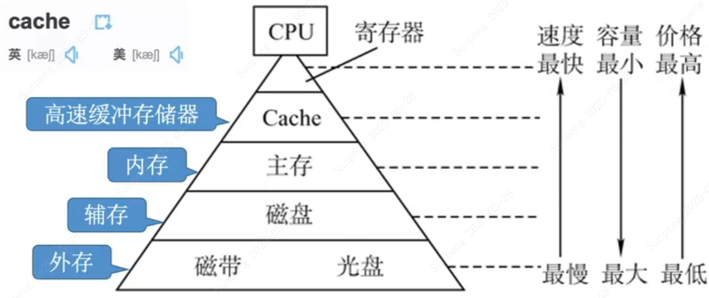
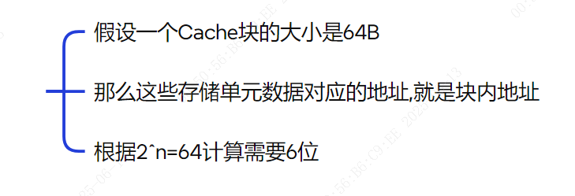

# 计算机组成原理

The principles of computer composition

## 计算机系统概述

### 计算机系统层次结构

#### 计算机硬件

冯诺依曼机

* 五大部件
* 指令和数据
* 二进制
* 指令=操作码+地址码
* 存储程序
* 运算器为中心

现代计算机

* 以存储器为中心
* CPU=运算器+控制器
* 主机=CPU+主存储器(内存?)
* I/O设备:输入设备,输出设备,辅存储器(磁盘?)

主存储器的部件

* 存储体:存储单元一般是8位的整数倍;存储元存1位;存储字长代表存储单元的代码的位数
* MAR:存储地址寄存器;代表存储单元的个数,$4位=2^4个存储单元$
* MDR:存储数据寄存器;代表存储字长

澄清

* 100Mbps:ps代表per second每秒钟;100M代表100M个;b代表比特位
* 12.5MB/s:12.5M代表12.5M个;B代表字节
* 区分B(字节)和b(比特位bit)
* 1B=8bit

运算器的部件

* ACC:累加器;存放操作数或运算结果
* MQ:乘商寄存器;存放操作数或运算结果(乘除法时)
* X:通用操作数寄存器;存放操作数
* ALU:算数逻辑单元;实现算数运算和逻辑运算
* 标志寄存器,这个在图上有专门画出,FR

控制器的部件

* CU:控制单元;分析指令,给出控制信号
* IR:指令寄存器;存放当前执行指令
* PC:程序计数器;存放下一条执行指令;自动加1

指令三步骤

* 取指
  * (PC) -> MAR
  * M(MAR) -> MDR
  * (MDR) -> IR
  * (PC)+1 -> PC
* 分析
  * OP(IR) -> CU
* 执行
* 题目中系列机的指令系统向后兼容,指的是时间上的向后兼容,即老机器开发的程序在新机器也能兼容使用

存取速度对比

* 寄存器>Cache>内存

相联存储器

* 既可以按照地址寻址,又可以按照内容寻址,详见第三章

三个字长

* 机器字长:等于CPU内部数据通路的宽度(例如通用寄存器宽度,例如ALU);和运算精确度密切相关
* 存储字长:一个存储单元中的位数,即MDR位数
* 指令字长:取决于指令的功能和格式

#### 计算机软件

翻译程序

* 编译器:可以翻译成汇编语言或者机器级目标代码文件
* 汇编器
* 解释器
* 机器级目标代码文件,可以理解为C语言的.o文件

语言级别

* 高级语言
* 汇编语言
* 机器语言

指令集体系结构

* ISA;软件和硬件之间的界限,即一台计算机应该能够支持哪些指令

#### 计算机系统的层次结构

以编程人员视角来看层次结构

* 虚拟机器 M4:高级语言;
* 虚拟机器 M3:汇编语言;一条汇编语言指令和机器语言指令是一一对应的
* 虚拟机器 M2:操作系统;向上提供系统调用指令
* 传统机器 M1:机器语言;执行二进制指令;一条二进制指令可能包含多个微指令步骤
* 微程序机器 M0:微指令系统;硬件直接执行微指令
* 重点关注M0和M1;具体指令的实现;对程序员透明(看不见)

#### 计算机系统工作原理

C语言源程序流程

* .c的源代码文件
* 经过预处理器,例如宏定义常量替换,得到.i源文件
* 经过编译器,得到.s汇编文件
* 经过汇编器,得到目标模块.o
* 经过链接器,链接其他.o目标模块,得到可执行文件.exe

### 计算机的性能指标

#### 主要性能指标

存储器总容量

* MAR有32位,MDR是8位,则总容量为$2^32*8 bit$
* MAR表示最多支持多少个存储单元
* MDR的位数就是存储字长

CPU主频和时钟周期

* CPU主频:指的是CPU内数字脉冲信号振荡的频率;单位Hz赫兹;一秒钟内时钟周期的数量
* 时钟周期:最小时间单位,每个指令至少需要一个时钟周期;单位s秒
* $CPU主频= \frac{1}{CPU时钟周期}$
* CPI和平均CPI:执行一条指令需要多少个时钟周期;时钟频率不会影响到CPI
* 执行指令的耗时为$CPI \times CPU时钟周期$
* CPU执行时间:$时钟周期数 \times 时钟周期长度$;$CPI \times 指令条数 \times 时钟周期长度$
* IPS:每秒执行多少条指令;$IPS= \frac{主频}{CPI}$;单位KIPS等,K代表数量千
* FLOPS:每秒执行多少次浮点数运算;单位KFLOPS等,K代表数量千;科学计算的性能参数指标

CPI相关

* 系统结构:硬件影响
* 计算机组织:硬件影响
* 指令集:影响到程序的指令条数,从而影响CPI

系统整体性能指标

* 数据通路带宽:指的是数据总线一次性所能够并行传送的信息的位数
* 吞吐量:单位时间内处理请求的数量;用户观点来看的性能参数指标
* 响应时间:指用户发出一个操作请求,计算机对该请求作出响应并获取结果整体的响应时间
* 基准程序:跑分软件

数量单位

* 描述存储容量,文件大小时:$K=2^{10}$, $M=2^{20}$, $G=2^{30}$, $T=2^{40}$
* 描述频率,速率时:$K=10^3$, $M=10^6$, $G=10^9$, $T=10^{12}$

改善性能

* CPU主频
* 并行处理
* 优化代码,减少时钟周期数
* 减少访问内存时间

## 数据的表示和运算

### 数制与编码

#### 进位计数制

概念

* 基数:r进制的基数就是r
* 常见二进制,八进制,十六进制,十进制
* 二进制:基数0,1;以B结尾表示
* 八进制:基数0,1,2,3,4,5,6,7;以O结尾表示
* 十六进制:基数0,1,2,3,4,5,6,7,8,9,A,B,C,D,E,F;以H结尾表示,或者以0x开头表示
* 十进制:基数0,1,2,3,4,5,6,7,8,9;以D结尾表示

进制转换

* 其他进制转换成十进制:小数部分从-1次方开始,基数r,位权
* 十进制转换成其他进制:整数部分除r取余法,小数部分乘r取整法(小数部分有可能无限循环);转换成其他进制可以先转换成二进制
* 二进制转换成八进制:3位一组,整数部分前面补0,小数部分后面补0;然后按照4,2,1的位权进行转换
* 二进制转换成十六进制:4位一组,整数部分前面补0,小数部分后面补0;然后按照8,4,2,1的位权进行转换
* 八进制转换成二进制:每一位都转换成3位的二进制数
* 十六进制转换成二进制:每一位都转换成4位的二进制数

真值和机器数

* 真值:带有正负号的实际数字
* 机器数:数字存储在机器里面的形式

#### 定点数的编码表示

概念

* 定点数:小数位数固定
* 浮点数:小数的位数不固定;科学计数法

定点数的表示

* 无符号数:没有正负;表示的范围取决于用几位二进制来表示,例如8位二进制数
  * n位的表示范围是$[0,2^{n}-1]$
  * 只有无符号整数,没有无符号小数
  * 无符号数没有原反补移码的概念
* 有符号数:分为定点整数和定点小数
  * 可以使用原码反码补码来表示;也可以用移码来表示定点整数
  * 定点整数:最高位表示符号位
  * 定点小数:最高位表示符号位
  * 符号位一般使用0代表正,1代表负
  * 小数点不占bit位置,是隐含在固定位置上
* 原码:和无符号数的表示一样,但是带符号位
  * 原码整数:n位的表示范围是$[-(2^{n-1}-1),2^{n-1}-1]$
  * 这里真值0有+0和-0
  * 原码小数:$n+1$位的表示范围是$[-(1-2^{-n}),1-2^{-n}]$
  * 例如8位原码能表示的不同数据有$2^8-1=255$(因为0有两种表示)
* 反码:正数的反码就是原码本身,负数的反码是原码按照位置进行取反(除了符号位);整数和小数一样的规则
  * 表示范围和原码一样
  * 例如8位反码能表示的不同数据有$2^8-1=255$(因为0有两种表示)
* 补码:正数的补码就是原码本身,负数的补码是反码+1,需要考虑进位
  * 从补码求原码的过程,也是取反+1
  * 补码整数表示范围$[-2^{n-1},2^{n-1}-1]$
  * 补码小数表示范围$[-1,1-2^{-n}]$
  * 从$x$的补码求解$-x$的补码:符号位,数值位全部取反,末位+1
  * 例如8位补码能表示的不同数据有$2^8=256$(0只有一种表示)
* 移码:在补码的基础上,将符号位取反
  * 只能表示整数
  * 移码的真值0也只有一种表示形式即1000 0000
  * 表示范围和补码一致
  * 例如8位移码能表示的不同数据有$2^8=256$(0只有一种表示)
  * 作用是对比大小,从最高位开始比较,谁先出现1谁大,一直比较到最后

补码真值0的问题

* 这里单独说一下补码的真值0里面的-0的情况:
* 由于-0的原码是1000 0000,而反码是1111 1111,此时补码+1,发生溢出,即1 0000 0000,舍弃溢出位后,剩余0000 0000,和+0的补码重复
* 这意味着补码的真值0只有一种表示形式就是0000 0000
* 那么自然多出一个位置即1000 0000,所以规定补码1000 0000代表$-2^7 = -128$
* 同理,补码小数也多了一个位置就是1.000 0000,代表-1

附图

各种码的作用

无符号数

* 可以表示主存地址

补码实现加减法

* 数论中余数定义$x=qm+r,0<=r<m$,q是整数
* 补数:找到负数的补数,让减法变成加法
  * 补数的求解方法是$模-a的绝对值=a的补数$,这里的模就是$2^8$,以$8bit$为例
  * 补数实际上就是补码
* 补码的作用就是让减法变成加法,ALU无需实现减法器,节省硬件成本;得到的结果也是补码
* 符号位一起参加运算
* 由B的补码来求解-B的补码,全部位(包含符号位)取反末尾+1

移码来判断数据大小

补码的位权

* 符号位理解为$-2^n$的位权,然后运算的时候将补码的符号位也参与运算,求解真值;如果符号位是0,那也成立(因为0乘以$-2^n$还是0)

补码和真值

* 补码和真值的表示是一一对应的
* 这意味着补码如果相同,真值的表示也相同;反之亦然

移码的偏置值

* 移码等于真值加上偏置值,默认的偏置值设置为$2^{n-1}$
  * 即$x_{真值}=[x_{移码}]-偏置值$
* 做计算时,把移码理解为普通二进制数(即不考虑符号位的概念)
* 补码符号位取反,实际上就是偏置值默认的情况

十六进制快速求补

* 从十六进制数字的最低位向左找到第一个非0数字
* 该位右侧的0保持不变
* 对于该非0数字,用16减去该数字
* 对于左侧的所有数字,用15减去对应的数字

#### C语言的整数类型

强制类型转换

* C语言的定点整数都是使用补码存储
* 当发生强制类型转换时,有如下规则
  * 无符号数和有符号数转换,不改变补码本身,只改变解释方式
  * 长整数变成短整数时,直接高位截断,保留低位
  * 短整数变成长整数时,根据短整数类型扩展,无符号高位补0,有符号补符号位

数据扩展

* 机器字长一般是固定的,但是内存中(代码中)可能存在多种长度的数据
* 两种方法把短数据扩展为长数据:零扩展;符号扩展
* 零扩展:高位补0,适用于无符号整数
* 符号扩展:符号位和数值位不变,多余补符号位,适用于有符号整数
* 当存在无符号和有符号加减运算时,按照无符号解释最终的运算结果

默认位数

* int 32位(即8字节)
* short 16位(即4字节)
* unsigned指的就是unsigned int 同样是32位

C语言的比较大小

* 通过前者减去后者,判断是否够减

### 运算方法和运算电路

#### 数字电路前置

* 真1假0
* 与或非三种基本运算,和异或,同或,与非,或非等运算
* 与运算
  * 表达式$Y=A \cdot B$
  * 一假即假(一0即0)
  * 与门
  
* 或运算
  * 表达式$Y=A + B$
  * 一真即真(一1即1)
  * 或门
  
* 非运算
  * 表达式$Y= \overline{A}$
  * 真假相反(10相反)
  * 非门
  
* 与非运算
  * 先与再非
  * 表达式$Y= \overline{A \cdot B}$
  * 原本的与运算结果真值表进行非运算取反
  
* 或非运算
  * 先或再非
  * 表达式$Y= \overline{A+B}$
  * 原本的或运算结果真值表进行非运算取反
  
* 异或
  * 两个输入不同,则为1;反之则为0
  * 表达式$Y=A\oplus B= \overline{A} \cdot B + A \cdot \overline{B}$
  * 由基本的与或非门实现
  
  
* 同或
  * 两个输入相同,则为1;反之则为0
  * 就是在异或基础上再进行非运算
  * 表达式$Y=A \bigodot B=\overline{A\oplus B}$
  

补充

* 异或运算,奇数个1则结果为1,偶数个1则结果为0
* 变形画法

* 运算优先级
  * 非>与>或
  * 可以把与类比乘法,或类比加法
  * 小括号也生效,最高优先级
* 离散数学相关公式,简化电路设计

多路选择器

* 多个输入,一个输出,一个控制信号
* 虚线表示,op英文缩写
* 控制信号位数m和输入个数k的关系是$m>=\lceil log_{2}k\rceil$

三态门

* 也是用于控制数据是否能够通过,但是只能拦截一条电路
* 和非门的区别是,非门没有控制信号,只有输入输出
* 有一些多路选择器可能会设置拦截所有电路输入

#### 基本运算部件

半加器

* 使用异或门和与门实现
* 两个输入,一个输出,一个进位

一位全加器FA

* 能够实现1bit位的加法运算
* 输入有三个:输入$A_{i}$,输入$B_{i}$,进位$C_{i-1}$
* 输出有二个:输出$S_{i}$,进位$C_{i}$
* $S_{i}=A_{i} \oplus B_{i} \oplus C_{i-1}$,因为奇数个1相加时结果是1
* $C_{i}=A_{i}B_{i}+(A_{i} \oplus B_{i})C_{i-1}$,因为至少两个1或者一个1一个低位进位1,才能进位1

n位加法器

* 将n个(例如8bit)串接起来构成n位加法器

* 不足之处:前一位的进位输入到后一位的全加器这个过程存在延迟,因为是串行的;行波进位;位数越多越延迟
* 串行进位的并行加法器

并行进位的并行加法器

* 进位信息都是同时产生的(并行),所以几乎无延迟,速度更快
* 只需要关注逻辑功能,不需要关注具体实现

带标志位的加法器

* OF:溢出标志;判断带符号数乘除加减,无符号数乘除是否溢出;1代表溢出0代表没有溢出
  * $OF=C_{n} \oplus C_{n-1}$,实现逻辑见下文
* SF:符号标志;判断带符号数结果正负;1代表负0代表正
  * $SF=S_{n}$,最高位就是补码符号
* ZF:零标志;结果是否为零;1代表结果为零0代表结果不为零
  * $ZF=S_{n}+S_{n-1}...$,仅全部为0时结果才为0,使用或非门实现
* CF:进位借位标志;判断无符号数加减法是否溢出;1代表溢出0代表没有溢出
  * $CF=C_{n} \oplus C_{0}$,实现逻辑见下文

ALU算数逻辑单元

* 作用:实现加减乘除等功能,与或非等功能,求补码,直送等功能;是CPU中运算器的核心;加法器是其核心
* ALU属于组合逻辑电路
* ALU支持k种功能,则控制信号位数$m>= \lceil log_{2}k \rceil$
* 计算机的机器字长,由ALU运算位数决定,所以相等
* 带有标志位,例如上述四种OF,SF,ZF,CF,这些标志位信息送到PSW(程序状态字寄存器)
  * 注意PSW就是FR(标志寄存器)

#### 定点数的移位运算

一图胜千言

#### 定点数的加减运算

* 重点了解补码的加减运算(补码的加减法不需要考虑符号位,符号位也参与运算)
* 两个正数或两个负数补码相加是可能溢出的,需要溢出判断
  * 两个正数相加,可能上溢,上溢变负数;而两个负数相加,可能下溢,下溢变正数
  * 校验方式1(离散数学):$V=A_{S}B_{S} \overline{S_{S}} + \overline{A_{S}B_{S}} S_{S}$,$A_{S}$代表$A$的符号位,$B_{S}$代表$B$的符号位,$S_{S}$代表结果$S$的符号位,$V=0$代表无溢出,$V=1$代表有溢出
  * 校验方式2:符号位的进位$C_{S}$,和最高数值位的进位$C_{1}$,当这两个不同,则代表溢出;使用异或$V=C_{S} \oplus C_{1}$,$V=0$代表无溢出,$V=1$代表有溢出
  * 校验方式3:使用双符号位,同样参与运算,当双符号位是01代表上溢,10代表下溢,相同代表无溢出;使用异或$V=S_{S1} \oplus S_{S2}$,$V=0$代表无溢出,$V=1$代表有溢出

双符号位补码

* 又称为模4补码;对应的单符号位补码,又称为模2补码(常用都是单符号位)
* 01代表上溢(正溢出),10代表下溢(负溢出),相同代表无溢
* 实际存储只存储一个符号位,在运算之前会复制一个符号位,所以没有额外增加存储的空间
* 模4补码具有模2补码的全部优点且更易检查加减运算中的溢出问题

#### 无符号数的加减运算

* 加法略,减法的方式是:参考补码,全部位取反末尾+1,计算后直接得到结果(不需要再转换回去),例如a-b,把b全部位取反末尾加1再和a相加,无需转换回
* 判断溢出的方法
  * 手算:十进制代入计算查看是否超出范围即可
  * 加法:最高位进位为1,代表溢出
  * 减法:最高位进位为0,代表溢出

#### 补码加减运算电路

电路图示意图如下

#### 无符号和有符号的混合

* 运算规则和补码加减法运算规则一样
* 至于运算的结果是按照无符号数解释还是有符号数解释,要看具体的指令集架构是怎么设计的
* 溢出的判断直接按照十进制方式判断

#### 无符号整数的乘法原理

手算原理

* 手算乘法原理(十进制):逐位相乘,错位相加
* 手算乘法原理(二进制):1乘以数等于其本身,0乘以数等于0,然后也是逐位相乘,错位相加规则

电路原理

如图

* 重复n轮加法和移位运算,一直到计数器$C_{n}=0$
  * n代表相乘的数字的位数,X代表被乘数寄存器,触发器C,乘积寄存器P,乘数寄存器Y
  * 步骤1:将乘数寄存器Y的最低位,送到控制逻辑那里进行判断
  * 步骤2:如果最低位是1,则执行加法,运算结果再写回乘积寄存器P,进位信息存储在触发器C
  * 步骤3:如果最低位是0,什么都不做
  * 步骤4:触发器C,乘积寄存器P,乘数寄存器Y,看做整体,逻辑右移一位
  * 步骤5:计数器$C_{n}$减一
* 两个n位无符号整数进行相乘,运算结果使用2n位暂存(最多2n位)
* 很多架构,仅仅保留低位的n位数作为结果,所以结果可能发生溢出
* n位相乘,需要n个时钟,如果一轮处理2位,则时钟优化为一半

溢出判断

* 如果高位的n位数不全为0,代表溢出,设置OF标志位1
* 如果高位的n位数全为0,代表没有溢出,设置OF标志位0
* 溢出的处理:不处理;或者使用溢出自陷指令(例如INTO)来触发执行操作系统的异常处理程序

#### 有符号整数的乘法原理

电路结构和示例

* 相较于无符号整数乘法电路,区别如下
  * 乘数寄存器Y后面还有一个辅助位,辅助位初始化为0
  * 每次读取2位到控制逻辑中
  * 不保存进位信息C
* 详解
  * 不探讨数学原理,只关注工作过程
  * 步骤1:将乘数寄存器Y的最低位,和辅助位,送到控制逻辑那里进行判断
  * 步骤2:如果最低位是0,辅助位是0;或者最低位是1,辅助位是1;什么都不做
  * 步骤3:如果最低位是0,辅助位是1,执行操作P+X
  * 步骤4:如果最低位是1,辅助位是0,执行操作P-X
  * 步骤5:乘积寄存器P,乘数寄存器Y,辅助位,看做整体,算数右移一位
  * 步骤6:计数器$C_{n}$减一
* 同无符号乘法,同样可能溢出
* 补码一位乘法(Booth乘法),指的就是当前的乘法原理

溢出判断

* 如果高位的n+1位数不完全相同,代表溢出,设置OF标志位1
* 如果高位的n+1位数完全相同,代表没有溢出,设置OF标志位0
* 溢出的处理:不处理;或者使用溢出自陷指令(例如INTO)来触发执行操作系统的异常处理程序
* 做题时快速判断溢出的方式:转换成十进制乘除,然后看寄存器位数范围

#### 其他乘法实现方式

* 由ALU,寄存器,移位器,控制逻辑实现乘法
* 阵列乘法器:n位乘法,可以在一个时钟内完成;是快速乘法器的一种
* 用逻辑运算,加减运算等效实现乘法(代码层面实现,可想而知最慢)

补充:原码乘法

* 用于浮点数尾数乘运算
* 积的符号位通过两个符号位异或得到
* 积的数值位使用无符号乘法
* 原码一位乘法:n轮加法右移操作实现
* 原码乘法原理:先取操作数绝对值相乘,符号位单独处理不参与运算

#### 无符号整数的除法原理

手算

* 规则:尽可能接近中间余数,又不能大于中间余数;二进制下,如果中间余数大于除数,则上商1

除法电路

* 以n位无符号整数为例,支持2n位除以n位的除法运算,得到n位商和n位余数
* 初始化时:
  * 将除数放在寄存器Y,将被除数放在寄存器R,Q(RQ看做一个整体)
  * 被除数不够2n位,则进行扩展,零扩展方法(无符号真值不变扩展方法)
  * 计数器$C_{n}$设置为n
* 控制逻辑检查:
  * 除数是否为0,抛出除数为0异常
  * 被除数小于除数时,商等于0,余数等于被除数
* 上商规则:如果$R-Y>=0$,则上商1,否则上商0
  * 注意$R-Y$的结果会写回寄存器R;如果是正数则不需要额外执行一次加Y的加法运算
  * 但是如果是负数,则需要额外执行一次加Y的加法运算,来恢复成R
* 第一轮处理:
  * 特殊,进行商溢出的判断,如果上商1,则发生商溢出异常,停止程序
  * 如果上商0,则不保留该位,$C_{n}$计数器也不进行自减,继续除法运算
* 继续循环处理$n$轮:
  * RQ整体左移1位,高位丢弃,低位上商
  * 上商,背后进行了加/减法(R和Y的加/减法);写使能到低位;注意上商规则
  * 计数器$C_{n}--$,当计数器为0时,除法运算结束
* 叫做恢复余数法,还有一种不恢复余数法,但难以理解
* 对于做题来说:求解最终状态的R和Q,只需要按照十进制求出R和Q,然后转换成二进制即可

双精度单精度除法

* 2n位除以n位就是双精度
* n位除以n位就是单精度
* 最终都是保留n位余数,n位商
* 无符号整数双精度除法可能商溢出,但是无符号整数单精度除法不可能商溢出

## 第三章.存储系统

### 3.1.存储器概述

#### 存储器层次结构

* 主存和Cache之间的数据交换,由硬件完成,解决主存和CPU速度不匹配问题
* 主存和辅存之间的数据交换,由操作系统的页面置换算法实现,实现了虚拟存储系统,解决主存容量不足问题

#### 存储器分类

* 按照存储介质
  * 半导体存储
  * 磁表面存储
  * 光存储
* 按照存取方式:
  * 随机存取存储器(RAM),读取时间和物理位置无关;按照地址访问;RAM,ROM;注意这两个RAM不是同一个RAM
  * 顺序存取存储器(SAM),读取时间取决于物理位置;串行访问;按照地址访问;磁带
  * 直接存取存储器(DAM),包含随机读取和顺序读取的性质;串行访问;按照地址访问;磁盘,光盘
  * 相联存储器(CAM),根据内容查找位置;按照内容访问;快表就是一种CAM
* 按照信息的可更改性质:
  * 可读可写的
  * 只读的(ROM),例如BIOS通常写在ROM中
* 按照信息的可保存性质:
  * 易失性存储器;断电后数据消失;主存RAM,Cache
  * 非易失性存储器;磁盘,光盘,ROM等
* 按照信息是否被破坏:
  * 破坏性读取;读取数据后原本数据被破坏;DRAM(动态RAM)
  * 非破坏性读取;SRAM(静态RAM),磁盘,光盘

#### 存储器的性能指标

* 存储容量:$存储字长 \times 字长$,例如1M×8位,存储字长由MDR位数反映
* 单位成本
* 存储速度:$数据传输率(主存带宽)=\frac{数据宽度}{存储周期}$
  * 数据宽度指的就是存储字长
  * 半字:指的是数据宽度(存储字长)的一半
  * 存储周期等于存取时间加恢复时间

#### 题目相关

* 编址:如何给地址空间分配唯一地址,默认按照字节编址
* 寻址:如何给出相应的地址;例如按半字寻址,指的是2B(如果存储字长是32位)
* 寻址单元数量:等于存储器的容量除以不同的寻址方式所对应的单个地址单元长度
* 现代计算机存储字长可以不等于机器字长,但是考试中一般是相等的
* 相联存储器是按照内容指定方式和地址指定方式相结合进行寻址的(因为有一些混合结构的也能够按照地址方式)
* ROM分类

* CD-ROM虽然带一个ROM,只是表示了只读特性,并不属于半导体存储器,而是属于光存储器,所以也没有随机存取特性

### 3.2.主存储器

#### 主存储器的组成

基本半导体元件和原理

* 存储元:存储一位;由MOS管(电路开关)和电容(存储电荷)组成
* 电容充电代表写入数据;电容放电代表读取数据
* 存储字长:一般8位
* 译码器:根据地址来找到对应的存储字;n位地址对应$2^n$个存储单元;得到的数据写入MDR,CPU通过数据总线取走数据
* 驱动器:放大译码器的输出的电信号
* 总容量:存储单元个数×存储字长;例如64K×16位,是$2^{16} \times 16bit$
* 控制电路:控制MAR和MDR,读控制线和写控制线,片选线等
* 片选线:CS/CE表示;用于选择某一块存储芯片(因为一条内存一般包含多块存储芯片)
  * $\overline{CS}$或者$\overline{CE}$表示低电平有效
  * $CS$或者$CE$表示高电平有效
  * 低电平有效指的是0V时(不加电时)电信号是0,此时激活芯片
* 读写控制线是一根线:$\overline{WE}$或者$\overline{WR}$表示;低电平表示写入,高电平表示读取;有横杠高读低写;没横杠高写低读
* 读写控制线是两根线:$\overline{WE}$允许写;$\overline{OE}$允许读
* 金属引脚的数量:看地址线,数据线,片选线,读取控制线数量

寻址

* 通常按照字节(每个字节)编址
* 按照字节寻址,按字(通俗理解为一行)寻址,按半字寻址,按双字寻址

#### SRAM和DRAM

SRAM和DRAM的对比

* DRAM:用于实现主存;动态随机存储器;属于RAM的一种;半导体;易失性存储器;破坏性读取;使用栅极电容存储信息
  * 刷新(读后再生):保证存储器内容不变化;原本是会自动消失的
* SRAM:用于实现Cache;静态随机存储器;属于RAM的一种;半导体;易失性存储器;非破坏性读取;使用双稳态触发器存储信息
* 现代内存,例如DDR3,DDR4,都属于SDRAM芯片

刷新

* 刷新:指的是2ms以内必须给电容充电一次(因为栅极电容的电荷只能维持2ms),否则即使不断电数据也会丢失(2ms是一般情况下)
* 每次刷新一行存储单元,指的是读取一行然后重新写入(一行里面有多个存储单元)
* 刷新是通过对存储单元进行“读但不输出数据”,即“假读”的操作来实现的
* 刷新时不需要选片,也就是所有DRAM芯片同时刷新;做题时只需要看单个DRAM
* 一次完整的刷新过程只需要一个存储周期,而不是两个,具体优化不再深究,硬件实现刷新,读取一行后重新写入
* 使用行列地址,减少译码器的选通线的数量
  * 地址x和地址线n的关系$x=2^n$
  * 地址线n和选通线m的关系$m=2^n$
  * 拆分以后,地址线n和选通线m的关系$m=2^{\frac{n}{2}} \times 2$
  * 例如8位地址,行地址使用前面4位,列地址使用后面4位
* 假设DRAM是128×128形式,读写周期(存取周期)0.5微秒,那么2ms就有4000个周期
  * 分散刷新:读写完就刷新一行,所以需要1微秒,那么2ms就有2000次刷新操作,足够;不存在死区;相当于更改了存储周期,刷新时间和存储时间不是单独分开的,都在同一个存储周期内的
  * 集中刷新:在最后保留一段时间专门用于刷新,例如128行只需要128个周期,即64微秒;
  * 死区指的是集中刷新的时间内是无法访问DRAM的;刷新时间×刷新行数
  * 异步刷新:2ms内只完成128次刷新,也就是每隔15.6微秒刷新一次,那么每15.6微秒就包含有0.5微秒的死区时间;让死区的时间尽量分散;注意刷新时间和存储时间是分开的这和分散刷新是不同的

行列地址和译码器选通线

送行列地址

* 指的是同时送出行地址和列地址,还是先后送出
* DRAM是分两次送,那么需要的地址线(地址引脚)都减半,也就是地址复用

DRAM芯片构建存储器

* 位扩展:
* 字扩展:
* 做题时,DRAM要理解为行列形式(一块块的豆腐,三维结构),而不是一行只有一个存储单元;从而得到行数
* 位平面:理解为每个存储单元对应的bit位数
  * 一层存一位的话,一个存储单元就是多层,例如8层就是8位;三维理解
* 存储器总线宽度和每个存储体芯片宽度:
  * 如果相同:使用流水线轮流启动
  * 如果不同:使用同时启动;例如存储器总线宽度64位,8个16M×8位的DRAM芯片扩展而成的16M×64位内存条
* 突发传送方式:根据首地址连续读取数据,必须是交叉编址方式
* 地址位置:通过计算二进制数字的末尾几位,来判断存储在哪一个DRAM芯片上;例如末尾是00,那肯定在DRAM1芯片上面
* 产生访问冲突:画出地址的位置,然后交叉编址访问,观察哪两个地址会冲突(甘特图也可以观察)
* 由于硬件限制,同时启动多个存储体(DRAM芯片),所有存储体只能访问相同行号(也就是一次读出一行);所以如果一个数字(例如double类型)存储多行,那么就需要多次读取

DRAM和SDRAM

* SDRAM又叫做同步的DRAM
* 传统DRAM异步方式和CPU交换数据
* SDRAM同步方式和CPU交换数据
* SDRAM也需要定期刷新
* SDRAM的行缓冲器通常使用SRAM实现
* 行缓冲器:也就是行缓冲寄存器,存储了一行的数据
* 突发传输方式:
* 行缓冲寄存器再根据列地址译码器得到列地址对应的数据(例如8位),送到数据缓冲寄存器

地址引脚和地址线

* 地址线一般说CPU,地址引脚一般说DRAM
* 地址引脚n代表行地址,列地址都是n位,那么CPU给出的地址位数是2n位;对应的DRAM容量是$2^{2n}$
* 地址引脚的计算方式:例如DRAM芯片规格4M×8位,则DRAM是11行,11列,位平面8位;地址复用计数,只需要11个地址引脚
* 要想地址引脚数量最少,那么行r和列c
  * 满足$|r-c|$最小
  * 由于行刷新,还需要让$r<=c$
  * 此时地址引脚n的数量是$n=max\{log_{2}r,log_{2}c\}$
* 注意行r和列c可以不同的

数据引脚

* 例如DRAM芯片规格4M×8位,则需要8个数据引脚

#### ROM

各种ROM

* MROM:厂家预装写入后,只能读取;掩模式;适合批量定制
* PROM:可编程,用户个性化定制写入;只读;
* EPROM:可编程;只读;可擦除,所以可以多次重写;
  * UVEPROM:紫外线照射后全部擦除数据
  * EEPROM:电擦除的方式,擦除特定内容
* Flash Memory:闪存;例如U盘,SD卡;在EEPROM基础上发展而来;写入时需要先擦除再写入,所以写入速度更慢
* SSD:固态硬盘;存储单元也是闪存芯片,区别在于控制单元不同;速度快,功耗低,价格高

ROM

* 每个存储元只需要单个MOS管
* 主板的BIOS芯片就是ROM,存储了自举装入程序,用于引导装入操作系统(开机)
* 逻辑上,主存由RAM,ROM组成,二者经常统一的编址;而我们常说内存条就是主存,实际上还应该包含主板的ROM芯片(例如BIOS)

#### 双端口RAM

* 优化多核CPU访问一根内存条的速度
* 例如两个CPU对双端口的RAM进行并行访问
* 主板电路设计的会更复杂

四种情况

* 两个端口对不同地址存取数据
* 两个端口对相同地址读取数据
* 两个端口对相同地址写入数据:非法操作
* 两个端口对相同地址,一个写入,一个读取:非法操作

#### 多体并行存储器

* 通俗理解为多条内存条;属于多模块存储器的一种
* 高位交叉编址:假设4条内存,需要两位在高位进行区分,这两位叫做体号,剩余位数作为体内地址
  * 连续编址方式
* 同理还有低位交叉编址
  * 交叉编址方式
* 读取时间:假设每个存储体存取周期是T,存取时间是r,假设T=4r,那么恢复时间就是3r;
  * 对于高位的交叉编址,由于按顺序读取时,高位地址都相同,所以都在同一个存储体内读取的,所以连续读取n个存储字就需要$nT$耗时
  * 对于低位的交叉编址,连续读取n个存储字,会循环在不同存储体之间进行读取,那么等第一个读取结束r时间以后,不需要等恢复,可以直接继续读取第二个存储体的存储字;连续读取n个存储字需要$T+(n-1)r$
  * 使用甘特图能反映情况
* 为什么讨论的情况是连续读取(访问)的?一般情况下,代码,程序,数组等,都是连续存储的
* 选择几个存储体?$m=\frac{T}{r}$最完美,效率最高,存储体数量最少
* 给定地址如何判断属于哪个存储体?地址x对存储体数量m取模运算
* 双通道内存:低位交叉编址的二体存储器;主频反映了读写周期T和r,所以主频尽量保持相同避免高频内存降频;内存容量不同导致多余的部分也无法满足多体并行这种方式

提高存储器访问速度的原因是

* 各个模块有独立的读写电路
* 信息预读:和操作系统缓冲区相关,而不是和这里的多模块存储相关

#### 单体多字存储器

* 每个存储单元存储m个字
* 每一次并行读取m个连续的字
* 总线的宽度自然也要扩展到m个字
* 指令和数据连续存储,是有利于提高读取速度的
* 过多跳转指令会影响效率

### 3.3.主存储器和CPU的连接

#### 连接的原理

#### 主存储器容量扩展

位扩展

* 使用8片8K×1位的存储芯片,扩展成为一个8K×8位的存储器,容量8KB

字扩展

字位同时扩展

* 此时地址线高位来产生片选信号的译码器;但是要注意最高位是不是有效的

#### 存储芯片的地址分配和片选

线选法

* 指的是使用多余的地址线来作为片选线的信号,多余n条地址,就能多出来n个片选信号,这样就能选择n个不同的芯片而不会冲突
* 存在浪费的地址;地址空间不连续
* 优化:使用一个简单的非门,构成一个1-2译码器;继续优化就变成了译码片选法;译码器详见上文

译码片选法

* 是线选法的优化;n条地址能够多出来$2^n$个片选信号
* 地址空间连续,电路复杂但是是实际使用的模式
* 例如3-8译码器,指的是输入3种能够有输出8种地址

#### 译码器

* 型号74ls138:多使能译码器
* CPU先送出地址信号,等稳定后发出MREQ(主存请求信号),通过译码器的多使能来控制片选信号的生效时间

#### 相关计算题

* 题目没有明确说是DRAM地址复用时,地址总线n,则地址数量$2^n$
* 计算需要多少芯片组成时,如果没有明确说明,并不需要考虑译码器的问题
* 题目直接写例如16KB,代表16K×8bit
* 片选信号,译码器,输入地址线:转换成16进制然后计算存储体的地址更方便
* 给定了内存地址区间,计算存储单元的数量是$尾地址-首地址+1$,一般得到的是十六进制结果,再转换成十进制
* 片选地址:代表了地址的高位的数字
* 计算首尾地址:给定了存储芯片的容量,例如32K,那么能够计算出编址单元的数量就是32K,那么转换成位数就是$2^15=32K$,即15位;再计算首地址和尾地址时,注意需要把片选地址也计算进来
* 题目中提及到了ROM和RAM,实际上没啥区别,只是ROM和RAM的芯片规格不同罢了
* 一般对于计算地址的题目,只需要关心有几组芯片,首先根据芯片规格来判断有几位,再根据总存储器的容量来判断一共有几位,这样就知道高位补几位了,这样就能得到每一组的地址范围:
  * 一般来说会再转换成十六进制
  * 使用十六进制得到每一个芯片的地址范围;本质上就是找规律问题
* MAR:用于对主存进行寻址,但是对于主存地址空间大小和主存储器大小,应该以主存地址空间大小判断;本质上是反映CPU寻址能力,而不是主存储器大小
  * 通常集成在CPU,但是逻辑上可以理解为主存储器的一部分

### 3.4.外部存储器

#### 磁盘存储器

* 也就是磁表面存储器:每次只能读写1bit数据
* 优势:容量大,单位价格低;重复使用;长期保存;非破坏性读取
* 劣势:速度慢;机械结构复杂;强磁场干扰

组成

* 存储区域:一个磁盘有多个盘面(记录面);一个盘面可以划分多圈的磁道;一个磁道划分多个扇区
  * 磁头数量:一个盘面对应一个磁头
  * 柱面数量:一整个磁盘中,不同盘面相同编号位置的磁道整体构成了一个圆柱面
  * 扇区数量:又叫做块;是磁盘读写的最小单位;一段弧长
* 其他
  * 磁盘驱动器:机械部分,旋转盘面,移动磁头;温彻斯特盘
  * 磁盘控制器:IO控制器,主流标准有IDE(ATA),SATA(串行ATA)等
  * 盘片:一般是双面都有磁性物质

性能指标

* 磁盘容量:
  * 非格式化容量:即总容量
  * 格式化容量:保留一部分,剩余实际能够使用的容量
* 记录密度:
  * 道密度:半径上,磁道数量每厘米
  * 位密度:磁道上记录的数据的位数每厘米;注意外圈的扇区和内圈的扇区能存储的容量是一样的,所以最内侧的位密度是最大的
  * 面密度:道密度×位密度
* 平均存取时间
  * 等于:寻道时间(机械运动时间长)+旋转延迟时间(转半圈这个期望值)+传输时间+磁盘控制器的延迟时间
* 数据传输率:
  * 磁盘转速r转/秒,每条磁道N字节,数据传输率是rN;或者是用容量除以一条磁道读取时间计算;
  * 如果题目中有扇区间隙的概念,则需要减去这个间隙时间

磁盘地址

* 地址包含:驱动器号,柱面(磁道)号,盘面号(磁头号),扇区号;题目里如果不说驱动器号也是对的

磁盘工作流程

* 包含的功能:寻址,读取,写入
* 读写操作是串行
* 磁盘工作步骤:取出控制字,执行控制字

磁盘阵列

* RAID(廉价冗余磁盘阵列):将多个独立物理磁盘组成一个整体逻辑磁盘
* RAID0(无冗余无校验磁盘阵列):交叉存储到不同物理磁盘;类似于低位交叉编址;
* RAID1(镜像磁盘阵列):存两份;冗余,可以校验;
* RAID2(纠错海明码磁盘阵列):4bit数据位+3bit海明校验位
* RAID不会影响磁记录密度,也不可能提高磁盘利用率
* 提高 RAID 可靠性的措施有:镜像;奇偶校验;条带化(通常要和镜像或者奇偶校验一起)

#### 固态硬盘

备注:

* 一个页相当于扇区
* 一个块相当于磁道
* 块为单位:擦除整个块,再写入数据
  * 先复制到其他块
  * 再写入新数据
  * 闪存翻译层重新映射逻辑地址和对应物理地址
  * 擦除次数过多,这个块可能坏掉

### 3.5.高速缓冲存储器

#### 局部性原理

* 时间局部性:现在访问的地址,不久以后可能再次被访问
* 空间局部性:现在访问的地址,附近的地址可能马上被访问
* 基于局部性原理,将周围的部分数据提前复制到Cache中,缓和CPU和主存速度矛盾
* Cache受限于规模,容量不会很大,一般都是几MB或者十几MB
* 缓存命中率,缺失率
* 平均访问时间:命中率$H$,访问一次Cache时间$t_{c}$,访问一次主存时间$t_{m}$,平均访问时间$t$
  * 公式为:$t=Ht_{c}+(1-H)(t_{c}+t_{m})$;这种情况是先访问Cache,未命中再访问主存
  * 或者$t=Ht_{c}+(1-H)t_{m}$;这种情况是同时访问Cache和主存,只要缓存命中则停止访问主存;最长$t_{m}$

关于周围的界定

* 基于块,主存和Cache之间以块为单位进行数据的交换;例如1KB一块
* 操作系统,将块称之为一个页/页面/页框

关于块号和块内地址

* 已知了块大小以及主存大小,能计算出块的数量
* 主存地址可以拆分为:块号,块内地址
* 块号:根据块的数量来计算表示块号需要的位数,例如4096块,需要12位表示
* 块内地址:根据块的大小来计算表示块内地址需要的位数,例如1KB,需要10位表示
  * 表示存储单元的地址

#### Cache和主存的映射方式

如何区分Cache和主存数据块的对应关系?

全相关联映射

* 放在Cache任意位置
* 以主存块号码作为标记,来区分是什么数据
* 缺点:对比标记慢,最坏情况下要对比所有标记
* 优点:Cache利用率高,命中率高
* 使用有效位:1时代表标记有效,0代表标记无效;初始化时0
* 复制数据到Cache时,有效位变1,标记位记录了主存块号码
* CPU访问主存地址:
  * 前n位(即主存块号码对应的位数)和Cache所有标记进行对比
  * 标记匹配而且有效位1,代表缓存命中;再根据块内地址访问具体的存储单元
  * 如果不能匹配或者有效位0,正常访问主存
* 主存块号码和标记位数一样

直接映射

* 位置的计算:主存块号码%Cache总的块数量;当结果冲突时会覆盖以前的
* 缺点:位置固定,Cache空闲,命中率低
* 优点:地址只需要对比一个标记,速度快
* 实际上并不需要真正进行取余运算,关注主存块号码的末尾n位数字就能判断位置了
  * n指的是:$Cache块数量=2^n$
* CPU访问主存地址:
  * 根据主存块号码的末尾n位数字,来确定Cache位置
  * 标记位也不需要再包含末尾n位数字
  * 若标记匹配而且有效位1,代表缓存命中;再根据块内地址访问具体的存储单元
  * 如果不能匹配或者有效位0,正常访问主存
* 标记位数不需要存储末尾n位!

组相关联映射

硬件电路如下

* 先针对Cache块分组,即主存块号码%分组数量;组内是随便放置的
* 例如2路组指的是2个块为一组
* 优点:两种的折中方式,综合效果好
* 实际上并不需要真正进行取余运算,关注主存块号码的末尾n位数字就能判断位置了
* CPU访问主存地址:
  * 根据主存块号码的末尾n位数字,来确定Cache位置
  * 标记位也不需要再包含末尾n位数字
  * (此时的匹配是组内一个个进行匹配)若标记匹配而且有效位1,代表缓存命中;再根据块内地址访问具体的存储单元
  * 如果不能匹配或者有效位0,正常访问主存
* 标记位数不需要存储末尾n位!

地址映射表

* 也就是控制算法位,包含有效位,tag标记位,脏位(也叫做一致性维护位),替换算法位
* Cache的一行包含控制算法位和数据部分
* 数据部分的大小就等于主存块的大小
* 有效位只需要1位
* tag标记位:要区分不同的映射方法,
  * 对于全相关联映射主存块号和tag标记位一样,
  * 对于直接映射,主存块号=tag标记位+n位行号(块号)
  * 对于组相关联映射,主存块号=tag标记位+n位组号
* 行就是块

#### Cache替换算法

每次访问主存块,都需要复制到Cache
Cache数据已满,如何处理?
替换算法:替换哪一个的算法
四种替换算法

全相关联映射

* Cache完全装满再替换

直接映射

* 对应位置不为空,直接替换

组相关联映射

* 分组内完全满了再替换

随机算法

* 随机替换
* 实现简单,没有考虑局部性原理,所以命中率低,实际效果不稳定
* 无需替换算法位

先进先出算法FIFO

* 先进入Cache的最先被替换
* 实现简单,没有考虑局部性原理,所以命中率低,实际效果不稳定
* 抖动现象:刚被替换的块很快又被调入(复制到Cache)

近期最少使用算法LRU 

* 每个Cache块设置一个计数器,记录多久没有被访问;Cache满后替换计数器最大的
* 如何记录?做题时,遇到要替换的块,从后往前看,找到没有被访问的,替换他
* 如何记录?
  * 未命中,有空闲块:新调入块的计数器置0,其余非空闲块+1
  * 未命中,无空闲块:替换计数器最大的块,新块计数器置0,其余全部+1
  * 命中时,命中行计数器清0,比他低的计数器+1,其余不变
* 块的数量如果是$2^n$,那么计数器只需要n位,而且Cache满后,计数器的值不会重复
  * 得益于"比他低的计数器+1"
* 基于局部性原理,Cache命中率高,实际效果好
* 抖动:频繁访问的主存块数量>Cache块数量

最不经常使用算法LFU

* 计数器记录Cache被访问的总次数,满后替换计数器最小的
* 如何记录?
  * 新调入的块的计数器置0,此后每一次被访问,计数器+1,满时替换计数器最小的
  * 计数器的值可能重复,可以按照块号码递增或者FIFO规则进行替换
* 计数器位数可能很多,局部性原理没有遵守,实际效果不如LRU

#### Cache写策略

CPU修改了Cache数据,如何保证和主存的一致性?

写命中

写回法

* 当CPU写命中Cache时,暂时只修改Cache内容,并不立即的写入主存,只有这个块被替换时才写入主存
* 脏位:设置1代表Cache数据被修改过
* 减少访问主存次数,存在数据不一致的隐患

全写法(写直通法)

* 当CPU写命中Cache时,必须把数据同时写入Cache和主存
* 访问主存次数增加,速度慢,但是能保证数据一致性
* 使用写缓冲:SRAM制作,FIFO队列,数据暂时先写入写缓冲,等不忙时专门的控制电路再控制写回主存;
  * 写操作频繁可能导致写缓冲满而阻塞

写不命中

写分配法

* 当CPU写不命中Cache时(理解为新增),把主存的块调入Cache,在Cache修改(相当于副本),等需要写回时再覆盖主存的
* 搭配写回法使用

非写分配法

* 当CPU写不命中Cache时(理解为新增),不调入Cache而是直接在主存修改(无副本)
* 搭配全写法使用

#### 现代Cache

* L1,L2,L3三级缓存
* Cache和主存之间,使用回写法加写分配法
* 各级Cache之间,使用全写法加非写分配法

#### Cache和主存的组织形式

* 窄形结构:每次传输一个字(存储字)
  * 连续的进行送地址-读出-传送,这个流程,假设是n个时钟周期
  * 缺失损失:n*一共传送的字数量
* 宽形结构:每次传输多个字,即多模块存储器的同时启动
  * 也是送地址-读出-传送这个流程,但是每次传输的字数是可以多个的
  * 缺失损失:n*一共传送了多少次
* 多模块交叉存取结构:每次传输一个字宽度,多模块交叉轮流启动
  * 第一个送地址-读出-传送流程开始后,在经过一个时钟周期后,启动第二个流程
  * 缺失损失:n+(总字数-1)*时钟周期
  * 缺失损失=发送地址+读取+准备第一个数据+传送*传送次数
* 多模块交叉存取结构性价比最好
* 存储器访问过程
  * CPU发送地址到内存:送地址
  * 访问内存的初始化时间:读出
  * 从总线上传送一个字:传送

#### 题目涉及知识点补充

* 主存容量是Cache容量的n倍,已知Cache有64行(块),那么主存有64n块,从而得到主存块号
* n路组相连,组号取决于组数量,组数量求法是先根据Cache容量除以Cache块大小得到块数量,再除以n得到组数量,再根据$2^x$公式得到组号位数
* 主存单元和主存块号不要等同
* 主存单元求解主存块号,再求解行号/组号:
  * 方法1:根据主存单元二进制地址,找到块内地址对应的位数,以及行号/组号对应的位数;然后判断是否Cache冲突
  * 方法2:根据主存单元地址,除以块的大小,得到整数部分,就是主存块号;再取余行数量/组数量,就得到行号/组号;然后判断是否Cache冲突
  * Cache冲突指的是同一行或者同一组
* 主存地址位数,硬件会解析块内地址和主存块号码地址出来;根据不同的映射方法,会把组号/行号也解析出来;而Cache中一个Cache行的容量,包含了数据部分,控制算法位部分(tag标记位,有效位,脏位,替换算法位);而这里的tag标记位的位数,取决于主存地址里面的tag标记位(主存块号码)
* Cache缺失损失时间,题目没有提及的话,默认就是窄形结构
  * 如果说明是交叉方式组织,那么就是第三种多模块交叉存取结构
  * 多模块交叉存取结构中突发长度一般也是支持的
* Cache容量越大,缺失率越低;而主存块越大Cache缺失率越大
* 主存块大小一般是几十个上百个字节
* tag位的比较(组相关联映射的硬件实现)
  * 组内同时进行tag位的比较,同时进行的次数就等于组的路数,例如2路就是同时比较组内2次tag
  * 每一个比较器的位数和tag位数一样
  * 计算tag=主存地址位数-块内地址位数-组号的位数
* Cache行位数=数据部分+控制算法位=主存块位数+有效位1位+替换算法位+脏位+tag
  * 主存块位数:例如主存块大小32B,如果求主存块位数则是32*8位,如果求块内地址则根据$32=2^n$
  * 回写法:有脏位
  * LRU:有替换算法位
  * tag:分别考虑三种映射规则
* tag位数
  * 全相联映射=主存地址位-块内地址位
  * 直接映射=主存地址位-块内地址位-行号
    * 行号=Cache的大小除以一个主存块的大小;再根据$2^n$计算
  * 组相联映射=主存地址位-块内地址位-组号
    * 组号=Cache的大小除以一个主存块的大小;得到的结果再除以n路的n;再根据$2^n$计算
* 读未命中,会把主存块调入Cache;而写的情况不同
* 时间局部性计算:循环语句的访问
* 空间局部性计算:数组的顺序访问;
* Cache存储的数据是主存副本,所以实际容量不能算Cache的
* 现代计算机系统中,指令Cache和数据Cache是分开的;
  * 指令Cache有更好的空间局部性
  * 数据Cache虽然数组的空间局部性较好,但是例如链表这种就不太好了
* Cache命中率:同时访问Cache和主存时
  * x代表Cache命中率
  * 以选择题为例:$100x+1000(1-x)<=115$

## 第四章.指令系统

### 4.1.指令系统

#### 指令格式

* 指令集(指令系统):一个计算机所有指令的集合
* 指令:包含操作码(OP),地址码(A)
* 汇编语言:助记符

分类1

* 零地址指令:不需要操作数,例如空操作,停机,关中断;堆栈计算机,数据结构,后缀表达式
* 一地址指令:只需要单个操作数,例如加1,减1,求反,求补;或者是需要两个操作数,但是其中一个操作数隐藏在寄存器中
  * OP(A1)->A1
  * 取指,读A1,写A1,访存3次
  * 区分A1和(A1):A1指的是地址,(A1)指的是地址对应的值
* 二地址指令:访存4次
* 三地址指令:访存4次
* 四地址指令:访存4次
  * 可以实现指令跳转,而不是单纯+1

分类2

* 机器字长:通常和ALU相关
* 存储字长:通常同MDR位数
* 指令字长:可能改变;单字长指令,指的是机器字长的多少倍
* 定长指令字结构
* 变长指令字结构

分类3

* 定长操作码
* 变长操作码
* 定长操作码:n位操作码,最多$2^n$条指令
* 定长指令字结构+变长操作码!

分类4

* 数据传送:例如LOAD,STORE
* 算数逻辑运算
* 移位操作
* 转移操作:例如JMP,JZ,JO,JC,CALL,RETURN,Trap等
* 输入输出操作:CPU和IO数据交换

#### 扩展操作码指令格式

* 定长指令字结构+可变长操作码=扩展操作码指令格式
* 短码不能是长码的前缀
* 操作码不能重复
* 频率高的指令,应该分配较短的操作码,减少时间

扩展操作码举例

* 指令字长16位
* 三地址指令15条:
  * 0000 xxxx xxxx xxxx - 1110 xxxx xxxx xxxx
* 二地址指令12条:
  * 1111 0000 xxxx xxxx - 1111 1011 xxxx xxxx
* 一地址指令62条:
  * 1111 1100 0000 xxxx - 1111 1111 1101 xxxx
* 零地址指令32条:
  * 1111 1111 1110 0000 - 1111 1111 1111 1111

计算问题

* 地址长度$n$,上一层留出了$m$种状态,下一层可以扩展出$m×2^n$种状态
* 题目说是n地址指令,那么就应该有n个地址码的长度;
  * 进一步可以得到操作码的长度
  * 根据公式来求解不同n的数量
* 一般先从n最大时开始分析
* 若指令长度n,每一个地址长度t,零地址a条,一地址b条,二地址c条,三地址d条
  * $a+b*2^t+c*2^{2t}+d*2^{3t}<=2^n$
  * 求x地址指令的条数:列出公式,要所有都转换成x地址指令;同时右边的$2^n$也要除以
  * 一条三地址等于$2^t$条二地址,以此类推
  * 二地址转三地址的话,$\frac{x}{2^t}$,向上取整;注意避免出错要一层层的转换计算
  * 求指令字长:列出公式,建议转换成三地址指令然后计算,这样数字小一些;注意指令字长需要是8位整数倍的问题

#### ISA

* 指令的地址由程序计数器PC给出
* 属于程序控制指令的有:无条件转移指令,条件转移指令,循环指令
  * 中断隐指令,实际上并不属于指令
* 应用程序不能使用特权指令
  * 实际上是操作系统才能使用的
* 单地址指令完成两个数的运算,地址码指明了一个操作数,而另一个操作数来自隐含寻址方式
* 判断是否属于ISA,可以从是否属于软件部分来判断
